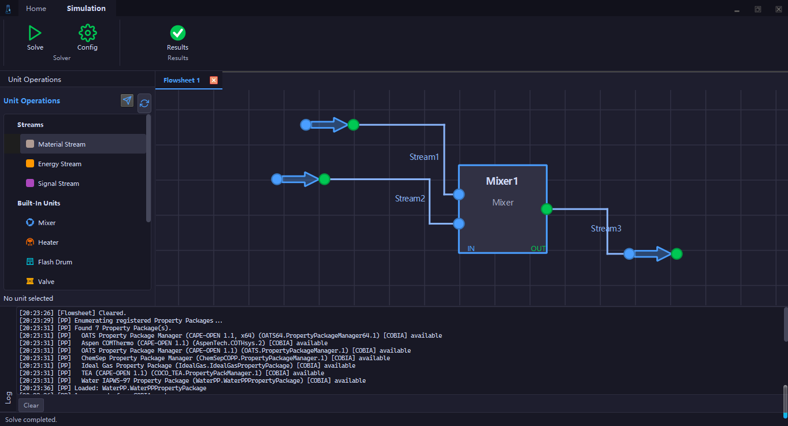

# ChemLab

A modern chemical process simulation platform based on COBIA (CAPE-OPEN Binary Interop Architecture), cross-platform (Windows / Linux / macOS), implemented in C++17 / Qt6.



## Project Goals

ChemLab aims to provide CAPE-OPEN property package and unit operation interoperability compatible with commercial software such as DWSIM, while building a native process simulation GUI. The core philosophy is "Engine + GUI parallel development" — each feature is implemented in ChemEngine and immediately integrated into the ChemLab GUI.

**However, more works are needed to be done to make ChemLab a complete process simulation platform.**

## Architecture Overview

```
┌──────────────────────────────────────────────────────────────┐
│                    ChemLab GUI (Qt 6)                         │
│  ┌──────────┬──────────────┬──────────────┬───────────────┐  │
│  │ Ribbon UI │ Flowsheet   │ Property     │ Data Charts   │  │
│  │           │ Canvas      │ Grid         │ & Tables      │  │
│  └──────────┴──────────────┴──────────────┴───────────────┘  │
├──────────────────────────────────────────────────────────────┤
│              ChemEngine Core (C++)                            │
│  ┌──────────┬──────────────┬──────────────┬───────────────┐  │
│  │ Flowsheet │ Solver       │ COBIA        │ Unit Ops      │  │
│  │ Manager   │(Topological) │ Wrappers     │ Registry      │  │
│  └──────────┴──────────────┴──────────────┴───────────────┘  │
├──────────────────────────────────────────────────────────────┤
│     COBIA Modules                   COBIA Property Packages   │
│  ┌──────────────────┐     ┌──────────────────────────────┐   │
│  │ ChemUnit/        │     │ ChemProp/                    │   │
│  │   MHExch         │     │   IdealGasPP, WaterPP        │   │
│  └──────────────────┘     └──────────────────────────────┘   │
└──────────────────────────────────────────────────────────────┘
```

## Project Structure

```
ChemLab/
├── CMakeLists.txt              # Root CMake build configuration
├── CMakePresets.json           # CMake build presets
├── ChemEngine/                 # Core simulation engine (static library)
│   ├── include/ChemEngine/     # Public headers
│   │   ├── COBIA/              # COBIA wrappers
│   │   ├── Flowsheet/          # Flowsheet manager
│   │   ├── Solver/             # Topological solver
│   │   ├── Base/               # Base types and compounds
│   │   ├── Interfaces/         # Interface definitions
│   │   ├── PropertyPackages/   # Property package interfaces
│   │   ├── Units/              # Built-in unit operations
│   │   └── Utils/              # Utility functions
│   └── src/                    # Source files
├── ChemLab/                    # Qt6 GUI application
│   ├── main.cpp                # Application entry point
│   ├── mainwindow.h/.cpp       # Main window
│   ├── ribbonbar.h/.cpp        # Ribbon toolbar
│   ├── simulationmanager.h/.cpp # Engine ↔ GUI bridge
│   ├── canvas/                 # Flowsheet drawing canvas
│   ├── dialogs/                # Various dialogs
│   ├── panels/                 # Dockable panels
│   ├── theme/                  # Global dark theme
│   └── resources/              # SVG icons and QRC resources
├── ChemProp/                   # COBIA property package modules
│   ├── IdealGasPP/             # Ideal gas property package
│   └── WaterPP/                # Water IAPWS-97 property package
├── ChemUnit/                   # COBIA unit operation modules
│   └── MHExch/                 # Multi-stream heat exchanger
├── third_party/                # Third-party dependencies
│   └── QWindowKit/             # Frameless window framework
└── Docs/                       # Project documentation
```

## Features

### Implemented

- **Ribbon UI** — Modern dark-themed Ribbon toolbar
- **Flowsheet Canvas** — Visual process modeling with drag-and-drop unit operations and material streams
- **COBIA Interop** — Full COBIA PME/PMC wrappers, compatible with CAPE-OPEN standards
- **Topological Solver** — Automatic solving engine based on flowsheet topology
- **Property Package Manager** — Auto-discovery, registration, and selection of property packages (IdealGasPP, WaterPP)
- **Unit Operation Panel** — Auto-discovery from registry/COBIA with categorized tree view
- **Dockable Panel System** — QDockWidget + tabify layout, freely drag, float, and close
- **Log/Diagnostics Output** — Real-time engine solver logs streamed to GUI
- **Solver Results Display** — Material stream result tables (temperature, pressure, flow, composition, properties)
- **MDI Document Area** — Tabbed multi-document interface

### Planned

- End-to-end demo flowsheet (Mixer + Heater + Flash)
- Property research and charts
- Additional unit operation modules
- Additional property packages

## Dependencies

| Dependency | Version | Description |
|------------|---------|-------------|
| CMake | ≥ 3.19 | Build system |
| Qt6 | 6.9.x | GUI framework (Core, Gui, Widgets) |
| MinGW-w64 | GCC 13.1+ | Windows compiler |
| COBIA SDK | ≥ 1.2 | CAPE-OPEN middleware |
| Ninja | — | Build generator |

## Build Guide

### Prerequisites

1. Install Qt6 (recommended 6.9.1) with MinGW-w64 toolchain
2. Install COBIA SDK (download from [CO-LaN website](https://www.colan.org/))
3. Install Ninja build tool
4. Ensure CMake ≥ 3.19

### Build with CMake Presets

```bash
# Configure (auto-detects COBIA SDK path)
cmake --preset qt6-minsizerel

# Build
cmake --build --preset qt6-minsizerel
```

### Manual Build

```bash
# Configure (specify Qt6 and compiler paths)
cmake -B build -G Ninja \
  -DCMAKE_C_COMPILER=D:/program/QT6/Tools/mingw1310_64/bin/gcc.exe \
  -DCMAKE_CXX_COMPILER=D:/program/QT6/Tools/mingw1310_64/bin/g++.exe \
  -DCMAKE_PREFIX_PATH=D:/program/QT6/6.9.1/mingw_64 \
  -DBUILD_GUI=ON \
  -DCMAKE_BUILD_TYPE=MinSizeRel

# Build
cmake --build build

# Install to Install/ChemLab/
cmake --install build
```

### CMake Options

| Option | Default | Description |
|--------|---------|-------------|
| `BUILD_GUI` | `ON` | Build ChemLab Qt6 GUI application |
| `COBIA_INCLUDE_DIR` | Auto-detect | COBIA SDK include directory |
| `COBIA_REGISTER` | Auto-detect | cobiaRegister.exe path |

## Running

After building, the executable is located at `Install/ChemLab/ChemLab.exe`. Ensure the following DLLs are in the same directory:

- Qt6 runtime DLLs (Core, Gui, Widgets, Svg, Network)
- COBIA runtime DLLs
- ChemProp and ChemUnit module DLLs
- Platform plugin (`platforms/qwindows.dll`)

## Development Guide

- Development documentation: [AGENTS.md](AGENTS.md)
- Roadmap: [Docs/ChemLab_Road_Map.md](Docs/ChemLab_Road_Map.md)
- COBIA technical reference: [Docs/COBIA.md](Docs/COBIA.md)
- Property package development guide: `ChemProp/docs/COBIA物性包开发指南.md`
- Unit operation development guide: `ChemUnit/docs/COBIA模块开发指南.md`

## License

This project is licensed under the GNU General Public License v3.0 (GPLv3) — see the [LICENSE](LICENSE) file for details.

> ChemLab uses Qt6 under the GPLv3 license. As a GPL-licensed application, the full source code must be made available to all users.

## Acknowledgments

- [CO-LaN](https://www.colan.org/) — CAPE-OPEN standards organization, providing COBIA SDK
- [Qt Group](https://www.qt.io/) — Qt6 cross-platform GUI framework
- [DWSIM](https://dwsim.org/) — Open-source chemical process simulator, providing CAPE-OPEN interop reference implementation